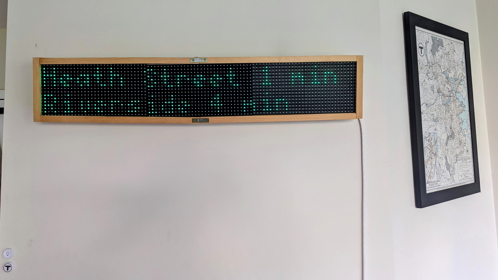

# A Custom MBTA Arrivals Sign



Because I used to commute via the T every day (and I love the T), I wanted a way to tell when the T was arriving at my nearby stop at a glance. To that end, I created a RGB LED sign, powered by a [Rapsberry Pi](https://www.raspberrypi.org/), that constantly displays the next two arrival predictions at specific stops near me. It was also extended to use a [Flic Button](https://flic.io/) for switching lines/directions to show.

### The MBTA API

The MBTA provides a public, RESTful API for accessing information about predictions, stops, trips, routes, and more. The documentation is available at [mbta.com/developers/v3-api](https://www.mbta.com/developers/v3-api). To best retrieve information for all the lines/directions I want, I use the [Event Stream protocol](https://www.mbta.com/developers/v3-api/streaming) the API provides, reading events as the API provides them, and updating a state held in Redis on the Raspberry Pi. This is all done in `mbta.py`, `mbtastate.py` and `prediction.py`.

To change which stops/directions you want to query, you can change `PREDICTIONS_TO_WATCH` defined in `mbtastate.py`. Each stop in the MBTA has a defined ID (the first value in each tuple), and the direction you want to watch has an id of either 0 or 1. I have no idea how hard it would be to extend this to work with the bus system, but it might be ok considering how the Silver line works.

Also, if you want to look at a stop other than South Station for the Silver line, you'll need to remove the `Sign.Color.SILVER` check in `get_button_state_tuple` in `sign.py`.

### The Sign

Speaking of the Sign - I used the python API for [rpi-rgb-led-matrix by hzeller](https://github.com/hzeller/rpi-rgb-led-matrix). I also followed the author's instructions for wiring the board, and opted to use the [Adafruit Matrix Bonnet](https://www.adafruit.com/product/3211) for connecting my Pi to the panels (after having tons of issues with bad connections using breadboard jumper cables). Finally, the sign code is a submodule of this repo because I had to build it on the pi to support a [slower GPIO speed](https://github.com/hzeller/rpi-rgb-led-matrix#gpio-speed).

The frame is custom made, don't ask about how it is powered.

### The Flic Button

As of right now, I no longer use the flic button connected directly to the Raspberry Pi for controlling the sign. This is due to battery problems with the button, as it has to be fully bluetooth connected at all times, rather than using BLE. Instead, I use the API defined in `app.py` to control the sign via a [Flic Hub](https://flic.io/shop/flic-hub) that makes API requests when the button is pressed. The flic button is able to use BLE to connect to the hub (though it does take some startup time before the first request in a while), saving battery.

### The internal API

`app.py` runs a lightweight web api for controlling the sign from other devices on the same local network. I use this to change the sign state from a website (also hosted on the Pi), and the Flic Hub also uses it to change the sign state.

### Custom Text

The sign _also_ listens to an external service hosted on an outside server. This allows it to pull text from a Queue of requested messages, and friends with access to another website I host can send messages to the Queue which then temporarily appear on the sign. 

### Actually running everything

All these scripts, as well as the flic library, are run via `/etc/rc.local` when the Pi boots. This is kinda hacky looking, but it works:

```bash
pi@raspberrypisign:~ $ cat /etc/rc.local
#!/bin/sh -e
#
# rc.local
#
# This script is executed at the end of each multiuser runlevel.
# Make sure that the script will "exit 0" on success or any other
# value on error.
#
# In order to enable or disable this script just change the execution
# bits.
#
# By default this script does nothing.

# Print the IP address
_IP=$(hostname -I) || true
if [ "$_IP" ]; then
  printf "My IP address is %s\n" "$_IP"
fi

echo "rc.local start" >> /home/pi/rclocal.log

# Start fliclib background server
su pi -c 'sudo -E /home/pi/mbta-sign/fliclib-linux-hci/bin/armv6l/flicd -f /home/pi/mbta-sign/fliclib-linux-hci/flic.sqlite3 > /home/pi/mbta-sign/logs/flic_server.log 2>&1' &

sleep 5

# Reset the Redis DB
redis-cli flushall

sleep 3
# Start sign python script, pipe to log file
su pi -c 'sudo -E python3 /home/pi/mbta-sign/sign.py > /home/pi/mbta-sign/logs/sign.log 2>&1' &

sleep 3
# Start MBTA python script
sudo -E -u pi python3 /home/pi/mbta-sign/mbta.py > /home/pi/mbta-sign/logs/mbta.log 2>&1 &

sleep 3
# Start button python script
sudo -E -u pi python3 /home/pi/mbta-sign/button.py > /home/pi/mbta-sign/logs/button.log 2>&1 &

sleep 3
# Start api server
su pi -c 'cd /home/pi/mbta-sign; sudo -E python3 -m uvicorn app:app --forwarded-allow-ips="*" --uds=/run/uvicorn.sock > /home/pi/mbta-sign/logs/web.log 2>&1' &

sleep 1
# Start web server
sudo /etc/init.d/nginx start

sleep 1
# Start custom text watcher
sudo -E -u pi python3 /home/pi/mbta-sign/customtext.py > /home/pi/mbta-sign/logs/customtext.log 2>&1 &

echo "rc.local end" >> /home/pi/rclocal.log

exit 0
```

It also logs everything to a few log files in `mbta-sign/log` on the pi. I am not sure all the `sleep` calls are necessary, but I was having issues with scripts not starting without them so :shrug:
